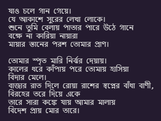
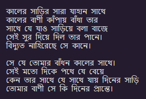
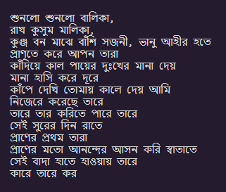
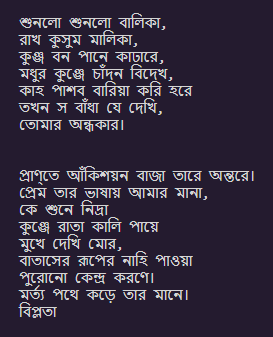

# RabindraAI

A text generator trained on poems of Rabindranath Tagore.
Have a look at the code from [RabindraAI.ipynb](RabindraAI.ipynb).

I have used a two layer LSTM (Long Short-term Memory) to create this text generator.

## Generated Examples

Have a look at some of the poems the AI generated:

### বাঁধা বাণী

### দিনের প্রান্ত

### সুরের দিন রাত

### নিদ্রা

> কবিতার নাম গুলো আমার নিজের দেওয়া! 😂

## Further Reading

- [The Unreasonable Effectiveness of Recurrent Neural Networks](http://karpathy.github.io/2015/05/21/rnn-effectiveness/)

## Credits

- Dataset taken from [Kaggle - Rabindranath Tagore Online Variorum](https://www.kaggle.com/nrkapri/rabindranath-tagore-online-variorum)

> বি.দ্রঃ এটা একটা ফান প্রজেক্ট এবং এডুকেশনাল পারপাজ এ করা।
